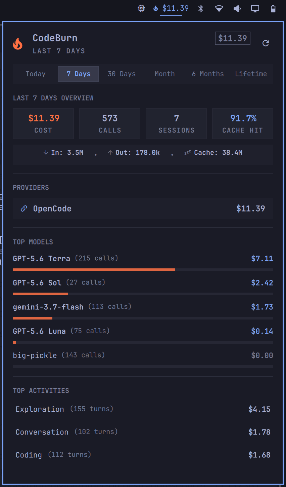

# omarchy-codeburn

> Lightweight, real-time AI spend and token usage tracker for the [Omarchy](https://omarchy.org/) status bar.

`omarchy-codeburn` is an Omarchy shell bar-widget plugin powered by [CodeBurn](https://github.com/getagentseal/codeburn). It gives you instant visibility into your AI assistant spend, active provider accounts (OpenCode, Anthropic, OpenAI, etc.), token throughput, and model consumption directly from your desktop panel.

<p align="center">
  
</p>

<a href="https://www.buymeacoffee.com/erzz"></a>

---

## Features

- **Concise Bar Badge**: Displays spend at a glance (e.g. `󰈸 $10.70`) with automatic 5-minute background caching and refresh.
- **Selectable Reporting Periods**: Switch reporting ranges on the fly with a single click or keystroke:
  - **Today** (default)
  - **7 Days**
  - **30 Days**
  - **Month**
  - **6 Months**
  - **Lifetime**
- **Rich Analytics Popup**:
  - **Period Overview**: Total cost, API call count, active sessions, and cache hit rate percentage.
  - **Token Throughput Strip**: Real-time input, output, and cache read tokens.
  - **Provider Spend Breakdown**: Granular cost tracking by provider (OpenCode, OpenAI, Anthropic, Fireworks, etc.).
  - **Top Models Breakdown**: Token spend per model with proportional visual burn distribution meters.
  - **Activity Breakdown**: Spend and turn counts grouped by activity (Exploration, Coding, Debugging, etc.).
- **Zero Configuration Required**: Uses a local `codeburn` binary first; otherwise, `npx` or `bunx` runs the pinned `codeburn@0.9.20` release.
- **Unobtrusive Recovery UX**: When offline or if usage logs are uninitialized, displays a graceful recovery hint rather than intrusive error dialogs.
- **Full Keyboard Navigation**: Supports standard Omarchy shortcuts (`←` / `→` for periods, `1`–`6` for direct jumps, `R` to refresh, `Esc` to close).

---

## Prerequisites

- **[Omarchy Linux](https://omarchy.org/)** with `omarchy-shell` (Quickshell).
- **Node.js** with `npx` (or `bun`) available in your environment `PATH`.

*(No global packages need to be installed manually; `npx` or `bunx` executes the pinned CodeBurn revision on demand.)*

---

## Installation

Add and enable the plugin directly using the Omarchy CLI:

```bash
omarchy plugin add https://github.com/erzz/omarchy-codeburn --enable
```

To position the widget in a specific location on the status bar (e.g., right next to `omarchy.agents`):

```bash
# Move or place next to existing widgets
omarchy bar move codeburn --after omarchy.agents
```

---

## Usage & Controls

- **Left-Click**: Toggle the CodeBurn details popup.
- **Right-Click**: Instantly trigger a live background data refresh.
- **Keyboard Shortcuts** (while popup is open):
  - `←` / `→` or `[` / `]` — Cycle through reporting periods
  - `1` to `6` — Direct jump to period (1: Today, 2: 7 Days, 3: 30 Days, 4: Month, 5: 6 Months, 6: Lifetime)
  - `R` — Refresh data immediately
  - `Esc` — Close popup
  - `Tab` / `Shift+Tab` — Switch between adjacent Omarchy panels

---

## Updating

Update to the latest version at any time with:

```bash
omarchy plugin update codeburn
```

---

## Uninstallation

To remove the plugin from your system:

```bash
omarchy plugin remove codeburn --yes
```

---

## Configuration

You can customize the polling interval directly in `~/.config/omarchy/shell.json` under your widget layout settings:

```json
{
  "id": "codeburn",
  "refreshIntervalSec": 300
}
```

---

## Attribution & Acknowledgments

This plugin interfaces with **[CodeBurn](https://github.com/getagentseal/codeburn)**, an open-source CLI for inspecting and optimizing LLM and AI coding assistant usage.

---

## License

[MIT](LICENSE) © 2026 Sean Erswell-Liljefelt
